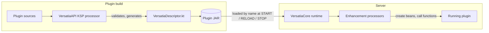

# Architecture

Versatia is split into two projects with independent builds and repositories:

| Project          | Kind           | Role                                                                 |
|------------------|----------------|----------------------------------------------------------------------|
| VersatiaAPI  | library        | public API, utilities and the compile-time code generation step      |
| VersatiaCore     | server plugin  | the runtime; interprets the generated output on the server           |

Plugins compile against VersatiaAPI only. VersatiaCore runs on the server next to them and
provides the behaviour behind the API. The two meet through one interface, `VersatiaEngine`, which
VersatiaCore registers in Bukkit's `ServicesManager` and `VersatiaPlugin` looks up in `onEnable`.

## Compile time versus runtime

The central design rule is that **nothing is discovered at runtime**. VersatiaCore never scans the
classpath or searches for annotated classes with reflection while the server is running.

1. **Compile time (VersatiaAPI).** A KSP processor runs as part of the plugin's build. It
   inspects the sources, validates them and emits the descriptor, a generated Kotlin `object`
   bundled into the plugin JAR that describes everything the framework has to act on. It also
   emits plain Kotlin code (constructor calls, function calls) so the runtime has nothing to figure
   out on its own.
2. **Runtime (VersatiaCore).** At a few well-defined lifecycle points the runtime reads the
   descriptor of each Versatia plugin and executes it: plugin start, reload, plugin stop. Between
   those points the descriptor is not needed.

The descriptor format is the compatibility contract between the two projects. VersatiaAPI
defines what is generated; VersatiaCore must be able to read it. See
[The descriptor](descriptor.md).

## Enhancements

The runtime does not hardcode what any annotation means. An annotation such as `@LocalBean` is an
*enhancement*: the compile-time step records where it occurs, and the behaviour lives in an
**enhancement processor** that the runtime loads by the class name written in the annotation
itself (`@VersatiaEnhancement`) and invokes for every recorded occurrence. There is no list of
processors anywhere: new behaviour means a new annotation and a new processor, not a change to the
pipeline. See [Enhancements and processors](enhancements.md).

This is the framework's only extension mechanism and the starting point of every feature. Three
rules follow from it:

- **VersatiaCore is deliberately simple.** It reads the descriptor, hands each processor the slice
  of elements carrying its id, and the processor does all the work. The pipeline knows nothing
  about dependency injection, lifecycle functions or any future feature.
- **A feature is definitions plus processors.** Adding one puts annotations, enums and processor
  ids into VersatiaAPI and processors into VersatiaCore; nothing else changes.
- **Packages are organised by feature**, as if the API and the runtime were slices of one
  monolith: a feature package holds the definitions in VersatiaAPI and the processors in
  VersatiaCore. The mechanism itself and the plugin bootstrap (`VersatiaPlugin`, `VersatiaEngine`)
  are elementary and belong to the root package `com.github.marcoral.versatia`. The descriptor is
  a technical detail of the mechanism, not a feature.

## Decisions taken

- Code generation uses **KSP** with **KotlinPoet**. The processor is the `ksp` module of
  VersatiaAPI.
- The descriptor is a generated `object VersatiaDescriptor` placed in the package of the plugin's
  main class, so the runtime loads it by name.
- The descriptor is a **flat list** of elements with no iteration strategy baked in; the runtime
  groups and orders them. Changing how the runtime iterates never requires regenerating plugins.
- The descriptor records **facts, not interpretations**: classes, supertypes, parameters and the
  annotations written on them. What a bean's name is, or which candidate `@Primary` picks, is the
  processor's business.
- Processors are **loaded by name** through the enhanced plugin's class loader and share state
  only through the per-plugin store the runtime drops on disable.
- **Encapsulation is preserved**: generated code calls visible constructors and functions
  directly and falls back to reflection for private ones, never initialising classes as a side
  effect.
- Compile-time checks are preferred to runtime checks wherever the information exists at build
  time: bean graphs are validated, including cycle detection and ambiguity, before any descriptor is
  written.
- The Kotlin runtime is provided **once**, by VersatiaCore. Plugins reach it through `depend:` and
  never list it under `libraries:`.
