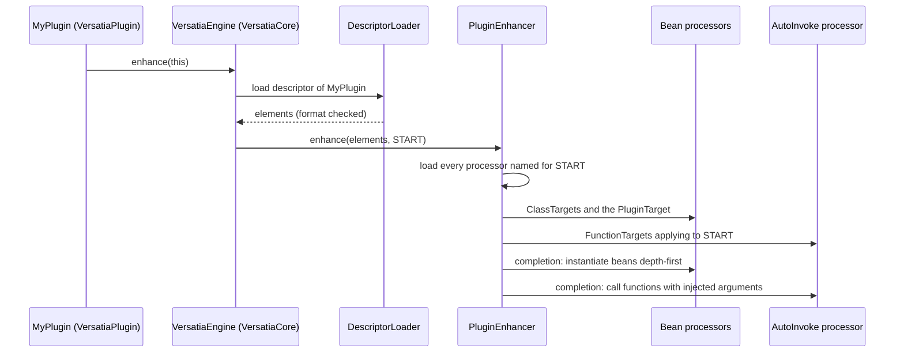

# The runtime

VersatiaCore interprets descriptors. This page follows a plugin from `onEnable` to its beans and
functions, and lists the rules the runtime applies.

The runtime is deliberately simple: it reads the descriptor, loads the processors it names, hands
each one its slice of elements and keeps the state those processors build for the plugin. Every
feature lives in its processors; the pipeline knows none of them.

## From `onEnable` to processors

1. `VersatiaCore.onEnable` registers the runtime in Bukkit's `ServicesManager` under the
   `VersatiaEngine` interface from VersatiaAPI. That interface is the only link between a
   plugin and the runtime; plugins never compile against VersatiaCore.
2. A plugin's main class extends `VersatiaPlugin`. Its final `onEnable` looks the engine up and
   calls `enhance(this)`; `onDisable` calls `disable(this)`. If the engine is missing, the plugin
   fails with `VersatiaCore is not running. Add it to depend: in plugin.yml.`
3. The runtime derives the descriptor class name from the plugin's main class
   (`<package>.VersatiaDescriptor`), loads it through the plugin's class loader, reads the Kotlin
   `object` instance and checks its format version. Nothing is scanned.
4. The enhancer keeps the elements whose phase applies to the current event, groups them by
   processor class, loads every one of those classes (a missing one fails the plugin before
   anything ran), hands each group to its processor, and finally runs the completion actions the
   processors registered.
5. When the plugin is disabled, the runtime runs its `PLUGIN_STOP` elements and then drops the
   plugin's state, closing every entry that implements `AutoCloseable`.

Errors surface as an `EnhancementException` thrown out of the plugin's `onEnable`, so Bukkit logs
them and disables that plugin only.

## Loading processors

A processor is resolved by the class name in the element with `Class.forName` through the enhanced
plugin's class loader. Bukkit's plugin loaders delegate to the loaders of the plugins under
`depend:`, so the class may live in VersatiaCore, bundled next to the API classes, or in any plugin
the enhanced one depends on. One instance per class is created, with the no-argument constructor
or by taking the instance of a Kotlin `object`, and kept for the lifetime of the runtime.

## Plugin state

Processors keep nothing per plugin in their fields. `EnhancementContext.state` is a `StateStore`:
entries are created on first use, kept across `START`, `RELOAD` and `STOP`, shared between
processors, and dropped when the plugin is disabled. `EnhancementContext.runtimeState` is a second
store that lives as long as VersatiaCore. The bean session lives in the plugin state, published as
`BeanResolver`; that is how the auto-invoke processor reaches the beans. The registry of exposed
beans lives in the runtime state, and a bean disappears from it with its owner when the session is
closed. See [Enhancements and processors](enhancements.md#plugin-state).

## Lifecycle events and phases

| Event    | Triggered by                                 | Phases dispatched                              |
|----------|----------------------------------------------|------------------------------------------------|
| `START`  | `VersatiaPlugin.onEnable`                    | `PLUGIN_START_ONLY`, `PLUGIN_RELOAD_OR_START`  |
| `RELOAD` | a Versatia reload (no command exists today)  | `PLUGIN_RELOAD_ONLY`, `PLUGIN_RELOAD_OR_START` |
| `STOP`   | `VersatiaPlugin.onDisable`                   | `PLUGIN_STOP`                                  |

## Descriptor format compatibility

Every descriptor carries the `major.minor` version of the format it was generated with; the runtime
supports the version of the VersatiaAPI it bundles. The two numbers are read through plain
getters *before* the descriptor is cast and before `elements` is touched, so even a descriptor of
another format produces the version message rather than a `NoClassDefFoundError`.

The runtime accepts exactly the supported version. Any other is an error that names the plugin,
both versions and the fix: rebuild the plugin against the matching VersatiaAPI when its format is
older, update VersatiaCore when it is newer. The plugin whose descriptor is rejected stays
disabled; others are unaffected.

## Bean processors

There is one processor per scope: `LocalBeanEnhancementProcessor`,
`ExposeSingletonEnhancementProcessor` and `ExposePrototypeEnhancementProcessor`. They do not create
anything themselves: each turns its elements into bean definitions and declares them in the
plugin's **bean session**, kept in the plugin state under `BeanResolver.KEY`, and the session
instantiates everything in the completion action of the start event. That is why all three scopes
can depend on each other inside one plugin regardless of the order in which their processors ran.
Declaring beans at any other event is rejected, and the compile-time step already refuses a scope
that would run a bean processor at another phase.

The definition is where the descriptor's facts become DI concepts: the bean name is the
`@Qualifier` attribute on the class or the default, `@Primary` is read from the attributes, and
each constructor parameter becomes a dependency of its type and the `@Qualifier` on it.

`PluginBeanEnhancementProcessor` receives the descriptor's `PluginTarget`, the plugin's main class,
and declares it in the same session as a local bean named `plugin` whose instantiator returns the
`Plugin` from the context: the instance Bukkit created becomes injectable under its own type and
every supertype, is never exposed, and nothing is constructed for it.

### Resolution

For every dependency (a type `T` and an optional qualifier) of a bean or of an auto-invoked
function:

1. Take the beans of the same plugin whose assignable types include `T`; with a qualifier, only
   the one whose name matches.
2. If that set is empty, take the exposed beans of plugins enhanced earlier, filtered the same way.
   Zero candidates: `no bean provides T, required by X`.
3. One candidate is injected. Among several, the single `@Primary` one is; otherwise the error lists
   the candidates by name, class and owning plugin, with the hint to add `@Qualifier` or `@Primary`.

The compile-time step applies the same rules to the local beans, so at runtime only exposed beans
can still produce these errors.

Instances are created depth-first, so dependencies always exist before their dependents, and each
definition is instantiated once per plugin. A cycle that slipped past the compile-time check is
still detected and reported.

### Scopes

| Scope               | After the owning plugin has started                                                            |
|---------------------|------------------------------------------------------------------------------------------------|
| `@LocalBean`        | kept in the plugin's session, injectable only into that plugin                                 |
| the main class      | a local bean backed by the existing plugin instance                                            |
| `@ExposeSingleton`  | the instance is registered and handed to every later plugin that asks                          |
| `@ExposePrototype`  | a factory is registered; it creates a new instance per consuming plugin, reusing the constructor arguments resolved when the owner started |

A prototype used by two beans (or functions) of the same plugin is created once for that plugin.
The owning plugin's own instance is never handed out.

### Lifetime

A plugin's bean session, and the beans it exposed, live exactly as long as the plugin: created when
it starts, closed when the plugin's state is dropped after its `PLUGIN_STOP` elements ran. Beans
are never re-created on reload; reload-phase functions receive the retained instances.

## Auto-invoked functions

The auto-invoke processor injects through the plugin's `BeanResolver`, the contract in VersatiaAPI
that any processor may use, and registers a completion action, so functions run after every other
processor of the event has finished. Functions run in descriptor order (class name, then function
name). For each function the processor

1. picks the receiver by `FunctionOwner`: the plugin instance from the context, the `INSTANCE` of a
   Kotlin `object`, or, for `FunctionOwner.INSTANCE`, the bean of that class from the plugin's
   session (`no bean X exists to call X.f() on` otherwise);
2. resolves the parameters through the bean session with the rules above;
3. calls the `Invoker`. Any exception is wrapped in an `EnhancementException` naming the function
   and the event, with the original as cause.

## What the tests cover

VersatiaCore's tests need no server. Unit tests drive the enhancer with hand-written descriptors
(creation order, isolation, singleton sharing, prototype semantics, ambiguity, lifetime, reflection,
the plugin instance as a bean, phases, missing processors), cover processor loading by name, and
cover descriptor lookup and the format-version rule. An end-to-end test compiles three sample
plugins with the real VersatiaAPI KSP processor (`kotlin-compile-testing`), builds class loaders
that delegate the way Bukkit's plugin loaders do, and runs the runtime over the generated
descriptors at start, reload and stop.
